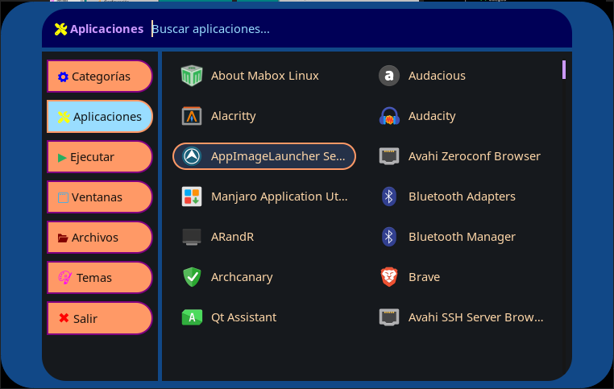

# rofi-whisker

   

Un lanzador de aplicaciones y conmutador de modos dinámico para **Rofi**, con soporte para categorización XDG navegable en dos niveles, selector de temas en vivo y un conjunto de apariencias retro y personalizadas (**Mac 1984**, **DOS Shell**, **MS-DOS**, **Windows 95**, **Palmera**, **LCARS**, etc.).

---



## 📋 Requisitos y Dependencias

Para asegurar el correcto funcionamiento del script y el renderizado tipográfico/visual de los temas, instala los siguientes paquetes:

### 1. Dependencias del Sistema
* **`rofi`**: Lanzador base.
* **`bash`**: Intérprete de comandos (v4.0+).
* **`findutils`**, **`coreutils`**, **`gawk`**: Para indexado y filtrado dinámico de archivos `.desktop`.
* **`gtk3`**: Proporciona `gtk-launch` para la ejecución limpia de aplicaciones desvinculadas del proceso de Rofi.

### 2. Fuentes Recomendadas

* **Nerd Fonts** (ej. *Symbols Nerd Font* o cualquier versión *Patched*):
  Necesaria para desplegar los íconos Glyphs de la interfaz (``, ``, etc.).
* **`ttf-pxplus-ibm-vga8`** *(Arch Linux AUR)*:
  Tipografía estilo bitmap para los temas **DOS Shell**, **MS-DOS** y **Mac 1984**.

```bash
  yay -S ttf-pxplus-ibm-vga8
```

## 📂 Estructura de Archivos

Los archivos deben estar ubicados en sus correspondientes directorios dentro de `~/.config/rofi`:

```
    ~/.config/rofi/
    ├── scripts/
    │   ├── rofi-whisker.sh     # Ejecutable principal (puede ir en otra ubicación, preferentemente incluída en el PATH)
    │   ├── category-nav.sh     # Navegador dinámico de categorías (2 niveles)
    │   ├── category.sh         # Filtrado para enlaces symlink cat-<Category>
    │   └── cat-All             # Symlink hacia category.sh (usado por la pestaña "Aplicaciones")
    ├── images/
    │   └── *                   # Fondos e ilustraciones usados por temas como Palmera y LCARS
    └── themes/
        └── whisker/
            ├── whisker-mac1984.rasi
            ├── whisker-dosshell.rasi
            ├── whisker-ms-dos.rasi
            ├── whisker-win95.rasi
            ├── whisker-palmera.rasi
            └── whisker-lcars.rasi
```

**Nota:** el tema activo se guarda en `~/.cache/rofi-whisker/selected_theme` (un archivo de texto plano con el nombre del `.rasi` elegido). Tanto ese archivo como el índice cacheado de `.desktop` (`~/.cache/rofi-whisker/index.tsv`) se crean automáticamente al primer uso — no hace falta tocarlos a mano.

Los temas que usan una imagen de fondo (como **Palmera**) la referencian con una ruta `background-image: url("~/.config/rofi/images/nombre.jpg", ...)` dentro del `.rasi` — si movés o renombrás las imágenes de `images/`, acordate de actualizar esa ruta en el tema correspondiente.

## 🚀 Instalación y Configuración

1.  **Clonar/Copiar scripts**: Otorga permisos de ejecución a todos los scripts dentro de `~/.config/rofi/scripts/`:

```
chmod +x ~/.config/rofi/scripts/*.sh
```

2. **Crear el symlink de "Aplicaciones"**: el `-modi` de `rofi-whisker.sh` solo usa `cat-All` (todas las apps sin agrupar); las categorías individuales las resuelve `category-nav.sh` internamente, así que no hace falta un symlink por categoría:

```
cd ~/.config/rofi/scripts/
ln -s category.sh cat-All
```

   *(Opcional: `category.sh` también admite symlinks por categoría — `cat-Network`, `cat-Office`, etc. — por si en algún momento querés un atajo que abra una categoría puntual directamente, sin pasar por el drill-down de "Categorías". No los necesita el flujo estándar del menú.)*

3.  **Asignar Atajo de Teclado**: Asigna la ejecución del script principal a una combinación de teclas en tu Gestor de Ventanas (i3, Hyprland, bspwm, XMonad, etc.), usando siempre la **ruta absoluta**:

```
~/.config/rofi/scripts/rofi-whisker.sh
```

   > ⚠️ El cambio de tema en vivo relanza el script a través de `"$0"`. Si el keybinding lo invoca por nombre relativo (resuelto vía `$PATH`) en vez de ruta absoluta, `$0` puede no resolver correctamente y el relanzamiento fallar en silencio.

## 🎨 Creando un tema nuevo

Cualquier `.rasi` nuevo que agregues a `themes/whisker/` necesita, además de la paleta de colores, esto en sus widgets de texto para que los íconos con `<span color="...">` se vean bien y no aparezcan como código crudo:

```css
prompt {
    markup: true;
}

button {
    markup: true;
}
```

Sin esas dos líneas, Pango no interpreta el markup y vas a ver el `<span>` literal en pantalla en vez del ícono coloreado.

## 🎮 Uso

-   **Inicio Estándar**: Ejecuta `rofi-whisker.sh` para abrir la pestaña predeterminada cargando el tema activo.
-   **Selección Inicial de Tema**: Ejecuta `rofi-whisker.sh select` para desplegar un selector `dmenu` inicial donde elegir el tema predeterminado.
-   **Cambio de Tema en Vivo**: En la barra lateral dentro de Rofi, navega al modo **🎨 Temas** para cambiar la apariencia al vuelo sin reiniciar la sesión.

---

## 👥 Créditos y Autores

* **Diseño Visual, Concepto y Maquetación**: **Daniel Horacio Braga**
  * Dirección de arte, maquetación RASI, diseño de paletas de color y recreación estética retro (*Mac 1984*, *DOS Shell*, *MS-DOS*, *Win95*, *Palmera*, *LCARS*, etc.).
* **Desarrollo de Scripts y Lógica de Sistema**:
  **Gemini (Google AI)** y **Anthropic Claude**
  * Programación en Bash (`rofi-whisker.sh`, `category-nav.sh`, `category.sh`), sistema de caché XDG para entradas `.desktop`, integración con Pango markup y gestión de procesos subyacentes.

* **Licencia: MIT**
