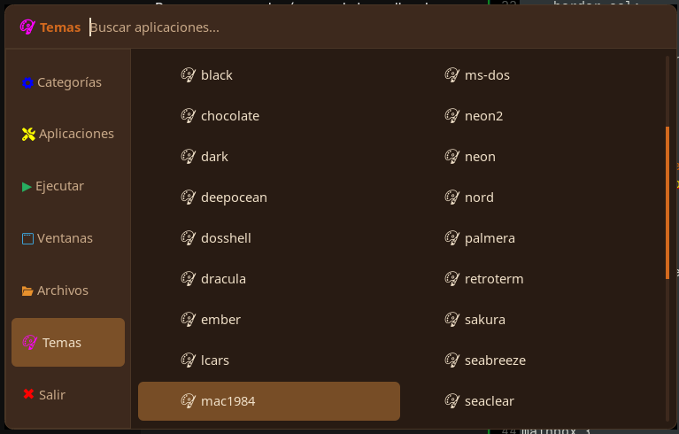
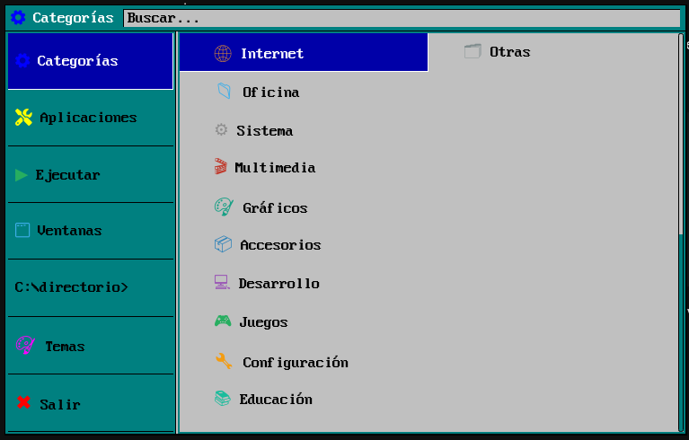
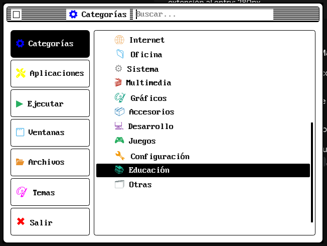
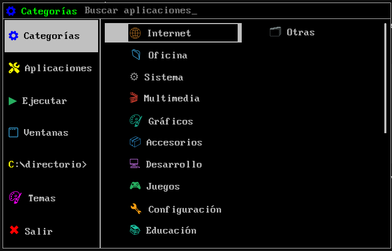
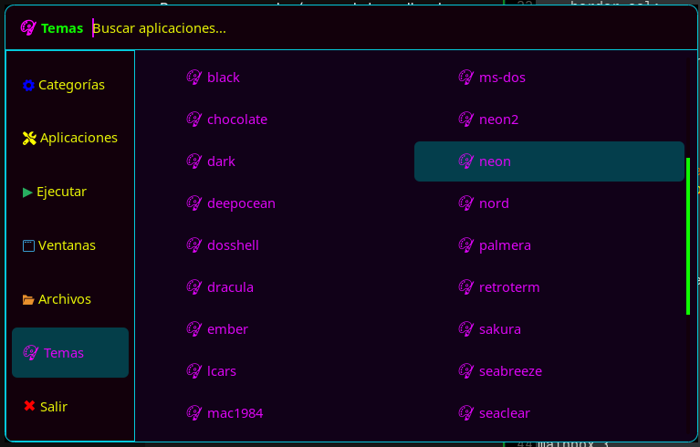
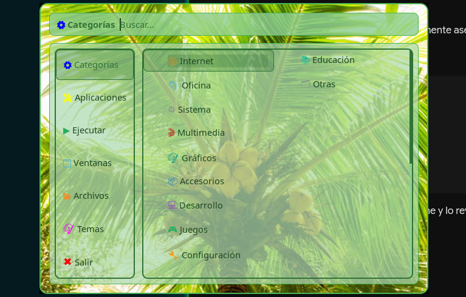
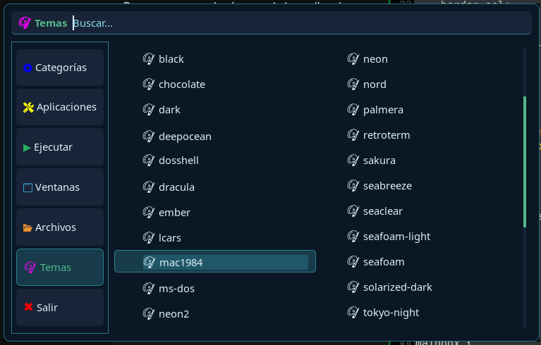
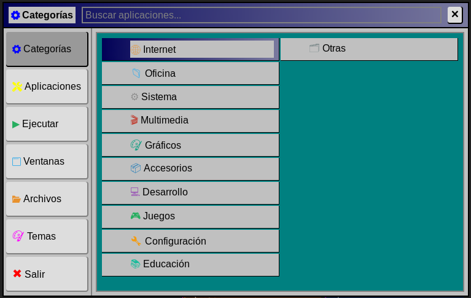
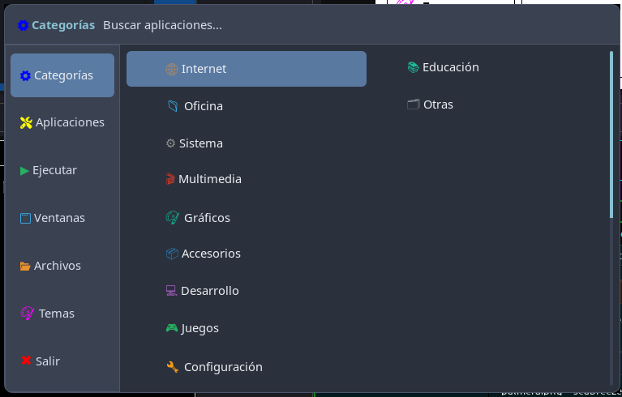

# Screenshots

  > **ES:** Para evitar conflictos con los temas de rofi puro, los temas que usa este script deben ir en su propia carpeta.  
  > **EN:** To avoid conflicts with pure rofi themes, the themes used by this script should go in their own folder.

`~/.config/rofi/themes/whisker/`

| Screenshots | |
|--|--|
| Chocolate | Dosshell |
|||
| Lcars | Mac1984 |
|||
| MS-DOS | Neon |
|||
| Palmera | Seabreeze |
|||
| Win95 | Nord |
|||
